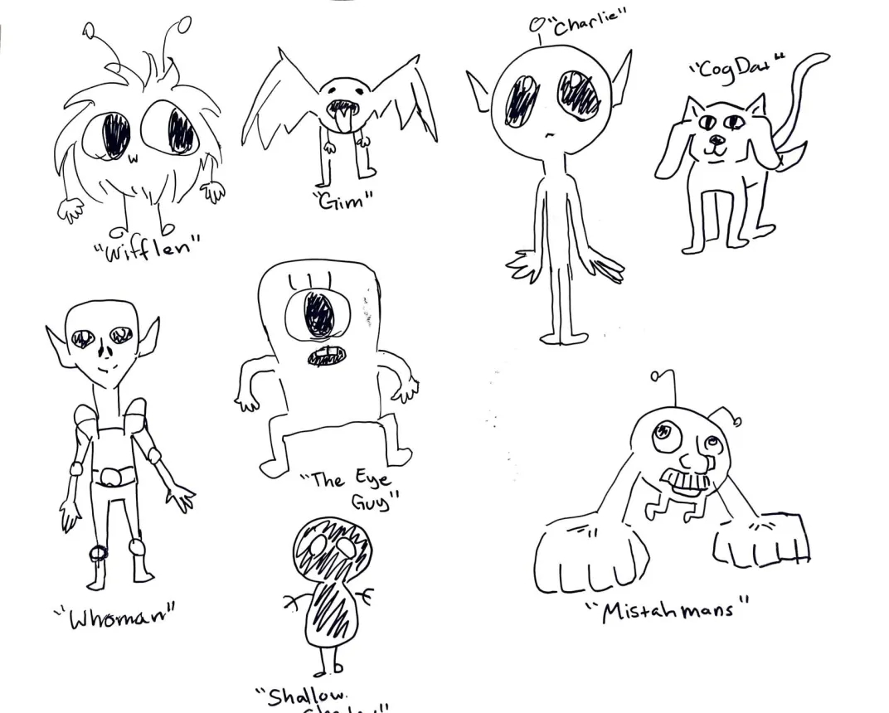
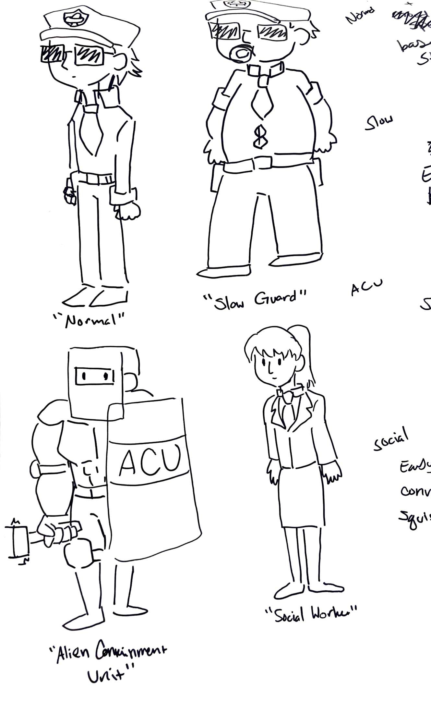
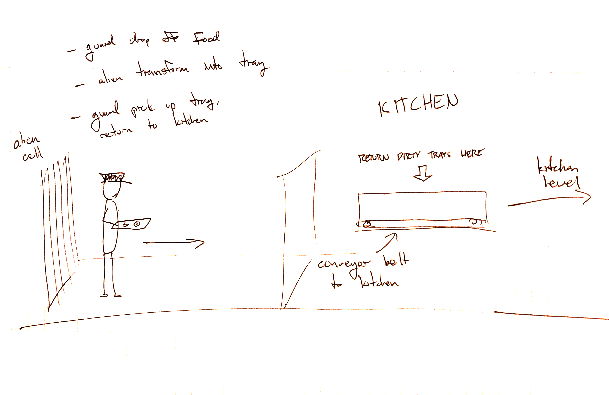
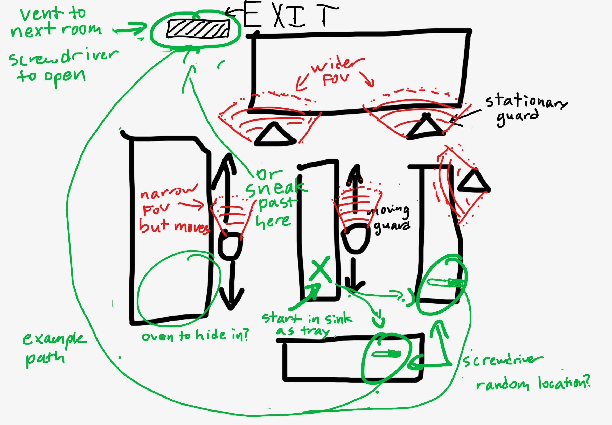
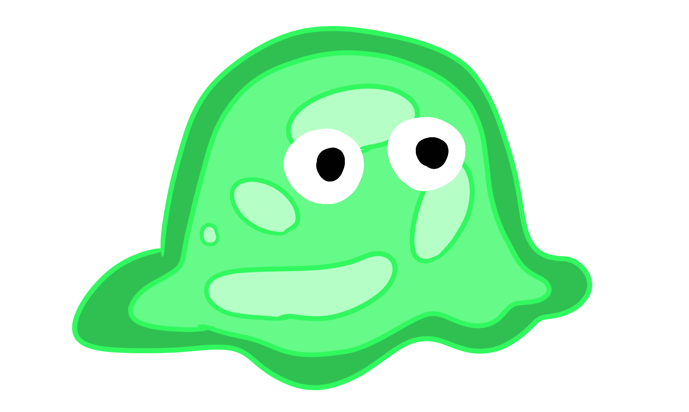
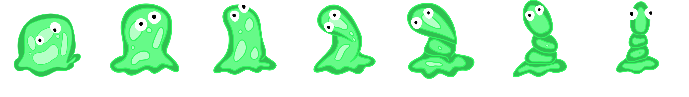

# Escape Area 51

(working title)

_Created by Caitlin Mallen, Jayden Tactay, and Rob Godfrey_

### Concept
_Escape Area 51_ is a 2.5D game based in Area 51 where the player is an alien escaping captivity. The player will attempt to avoid getting caught by Area 51 guards as they make their way to an exit to meet up with an alien rescue squad. The player has the ability to transform into guards or objects to help escape detection.

**Emotion/Mood**

A fun and lighthearted game with (maybe) comical violence

**Goals**

- Make it to the exit without getting captured
- Avoid detection (or kill/disable once detected)
- Solve puzzles to access certain areas (make use of guards and items)

**Obstacles**

- Guards chase the player (line of sight, proximity for hearing)
- Security cameras
- Impassable checkpoints that the player normally can’t get through
- Puzzles

**Rules**

- Guards patrol on set path and will chase the player if detected
- Checkpoints save player progress
- Use transformation powers to avoid or trick guards, or access other areas
- Start with limited transformation abilities, gain more each level

**Level Progression**

- Each floor is a new level
- The player will start at the bottom and work their way up to the top, where the exit
- The closer to the exit, the more difficult the puzzles and obstacles will become
- Each floor will favor a different transformation to solve puzzles, avoid detection, and advance to the next floor

**Interaction/Feedback**

- WASD to move
- Other forms of movement for each object
- Guards chase when hearing/seeing the player
- The player is required touch an object for a few seconds before gaining the ability to transform into that object
- Health system

**Suspense in Achieving Goals**

- More guards the longer you take?
- AI gets harder the more you progress
- Cooldown in alien powers
- Can only stay transformed for a limited period of time

**Rewards**

- New objects to transform into

#### Initial Concept Art and Storyboard Sketches

_Alien character concept art (Caitlin)_

_Guard characters concept art (Caitlin)_

_Concept for the first level, where a guard carries the alien (transformed as a food tray) to the kitchen (Rob)._

_Concept for the kitchen level. The player must navigate through the kitchen without being detected, find a screwdriver, and escape through a vent._

#### Main Character Design and Animation

_The final character design for the main character_

The final main character is an alien who appears as a light green amorphous blob with two large eyes. 

_Main character movement animation_

The character has a simple idle animation and can move in all four cardinal directions. The character's movement is controlled by the player using the `W`, `A`, `S`, and `D` keys. The player can also press the `Space` key to jump.

_Alien transformation animation_

#### Level Design and Gameplay

_Initial prototyping of the guard AI_

Guards patrol on a set path and will chase the player if detected. If the player evades a chasing guard, the guard will eventually return to their patrol area.

<iframe width="560" height="315" src="https://www.youtube.com/embed/EJqzYUt0DG0?si=S7xSdaB51axKDmWd" title="YouTube video player" frameborder="0" allow="accelerometer; autoplay; clipboard-write; encrypted-media; gyroscope; picture-in-picture; web-share" referrerpolicy="strict-origin-when-cross-origin" allowfullscreen></iframe>

_Mid-semester prototype showing character movement/animation, basic level design, and guard AI_

### Final Game Demo

<iframe width="560" height="315" src="https://www.youtube.com/embed/RMStoDyz44E?si=1281wn3adjmK6gpo" title="YouTube video player" frameborder="0" allow="accelerometer; autoplay; clipboard-write; encrypted-media; gyroscope; picture-in-picture; web-share" referrerpolicy="strict-origin-when-cross-origin" allowfullscreen></iframe>

[Download on itch.io](https://jaydent22.itch.io/escape-area-51)

### Development

This game was developed using issue-driven project management: we leveraged Trello to track project to-dos as cards in our Trello board. Each card was assigned to one or more project members.

[Link to Trello board](https://trello.com/b/HyR2fKD2/good-enough)

### Team

    

        
        
<b>Caitlin Mallen</b>

        
ACM Senior Art

    

    

        
         
<b>Jayden Tactay</b>

        
ICS Senior Coding

    

    
 
        
        
<b>Rob Godfrey</b>

        
ICS Senior Coding

    

